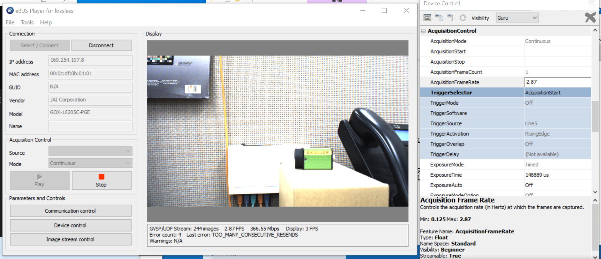
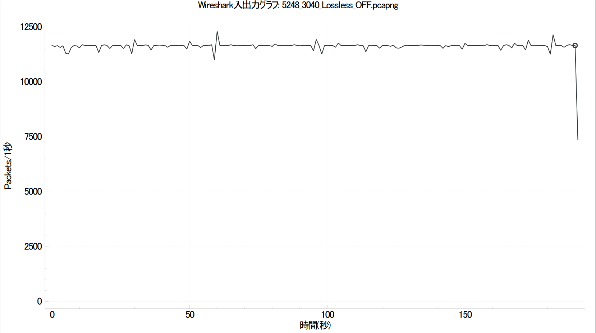
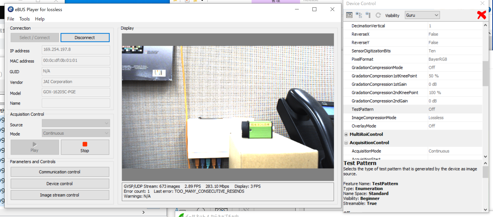
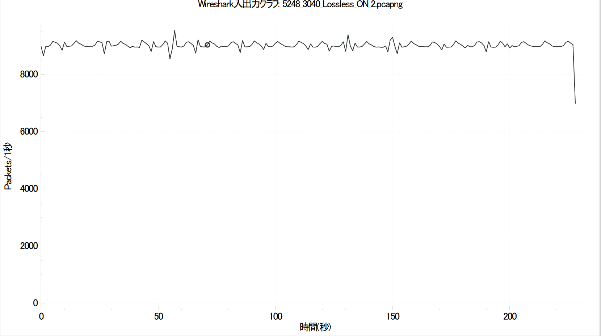

# Data Transfer
**Environment:** Intel(R) Core(TM) i9-10900X CPU @ 3.70GHz, 32Gb, Windows10 Pro 21H2 
**Camera:** 16205C-PGE 
**Device Version:** DV 5.1.0.0 
**Image Size:** 5248x3040 
**FPS:**  Approx. 2.9Hz 
**GAIN:**   1 

## ImageCompressionMode = Off
**eBUS Player Display** 

 
**WireShark Packet Transfer Graph** (Average Packet Size: 3986Byte; Average Buckets per Second: 11647.0) 
&emsp;  

## ImageCompressionMode = Lossless
**eBUS Player Display** 

 
**WireShark Packet Transfer Graph** (Average Packet Size: 3986Byte; Average Buckets per Second: 9023.0) 
&emsp;  

