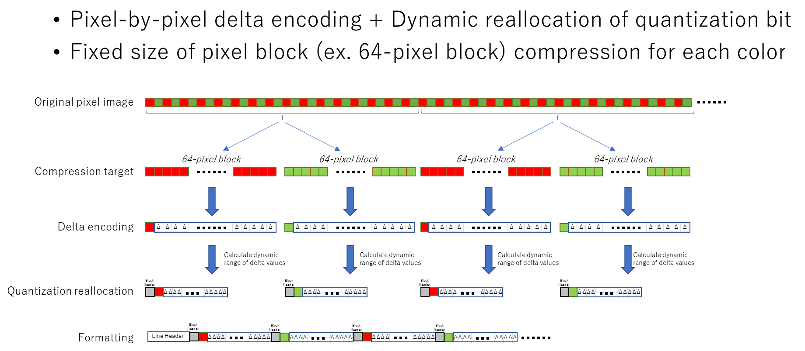
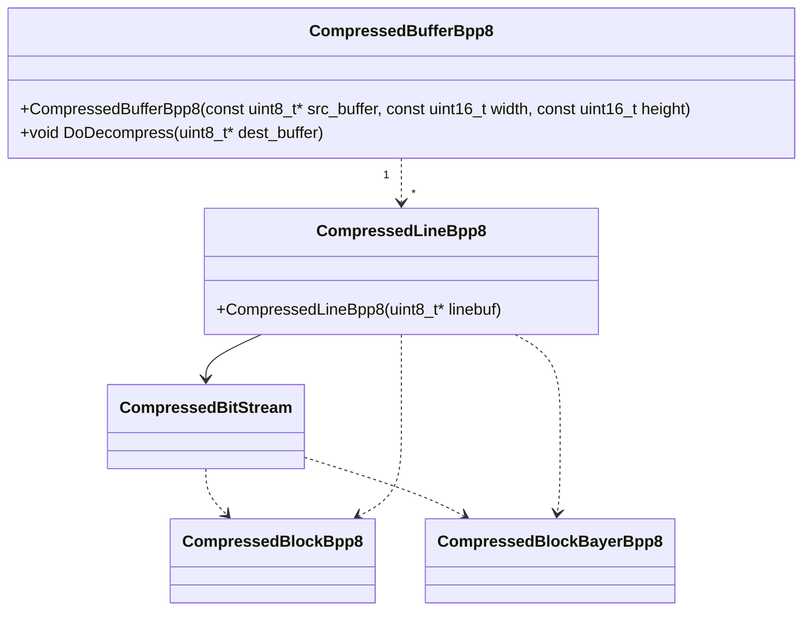

# Module Configuration

## Compression Specifications

## Class Diagram

### CompressedBufferBpp8

#### CompressedBufferBpp8()

This class decompresses 8-bit image data compressed on a frame buffer.

The decompression process is performed by setting a pointer to the frame buffer received from the camera in the CompressedBufferBpp8 constructor and setting the previously allocated decompression target buffer in the DoDecompress() method.

It is necessary to configure the camera's ImageCompressionMode setting in advance and execute it when Lossless is enabled.

The decompression process is performed in parallel by threads. The decompression threads create thread pools. The default number of threads to create is the number of cores obtained using `std::thread::hardware_concurrency()`. If the number of threads is specified as an argument to GetInstance() mentioned below, the specified number of threads will be created.

https://github.com/jai-rd/lossless_compression/blob/f903efad71f7d45f33d5cb0706cc5b719bd37911/src/compressed_buffer_bpp8.cpp#L19

Thread pools are created as Singletons, so they are not generated for each frame.

#### DoDecompress()

This method performs the decompression process, by setting a buffer to provide the decompression result to this method and execute it.  This method performs parallel processing using a thread created by the constructor for each line.

### CompressedLineBpp8

#### CompressedLineBpp8()

Set a pointer in the constructor to indicate the start position of each line of the frame buffer. Create a CompressedBitStream class to process compressed data using BitStream, and use CompressedBitStream for decompression processing. 

Line compressed data consists of blocks of fixed width, and each block has a different number of bits of compressed data. Each block has a BlockHeader, and the CompressedBlockBpp8 and CompressedBlockBayerBpp8 classes perform decompression operations according to the BlockHeader. CompressedBlockBayerBpp8 is a decompression class for Bayer images, but when a compressed Bayer image received from a camera is decompressed, it is not aligned like `BGBGBG`...  Therefore, a process has been added to replace the decompressed data with a general alignment such as `BGBGBG`...

### CompressedBitStream

Class for buffer handling in BitStream

Currently `CompressedBitStream` is implemented to create one class for each line. Therefore, as shown below, Decompress() is looped for the number of blocks in a line. This is because the block boundary is not in bytes, but is designed to span bytes.

https://github.com/jai-rd/lossless_compression/blob/f903efad71f7d45f33d5cb0706cc5b719bd37911/src/compressed_line_bpp8.cpp#L43-L46

##### CompressedBitStream #ToIntValue()

https://github.com/jai-rd/lossless_compression/blob/f903efad71f7d45f33d5cb0706cc5b719bd37911/src/compressed_bitstream.hpp#L19

Process to convert bit data from `start_bit` to `bit_width` to int16.　This supports bit data spanning 2 bytes, but not data spanning 3 bytes or more. Currently, compression is only supported for 8-bit data, but if compression is to be supported for PixelFormat of 10 bits or larger, it will be necessary to support the case where the data spans 3 bytes.

### CompressedBufferBpp8d, CompressedLineBpp8d,CompressedBlockBpp8d

Class for debugging cameras and tools

[design_debug.md](design_debug.md)

