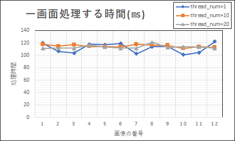
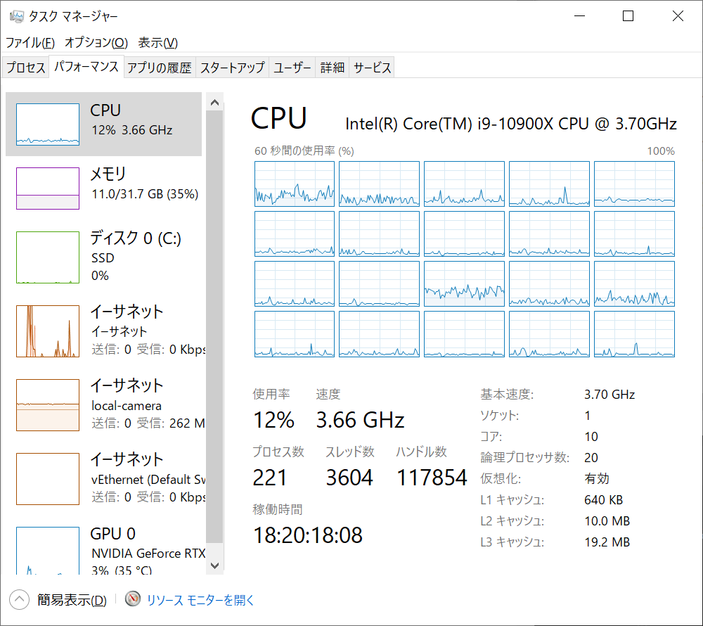
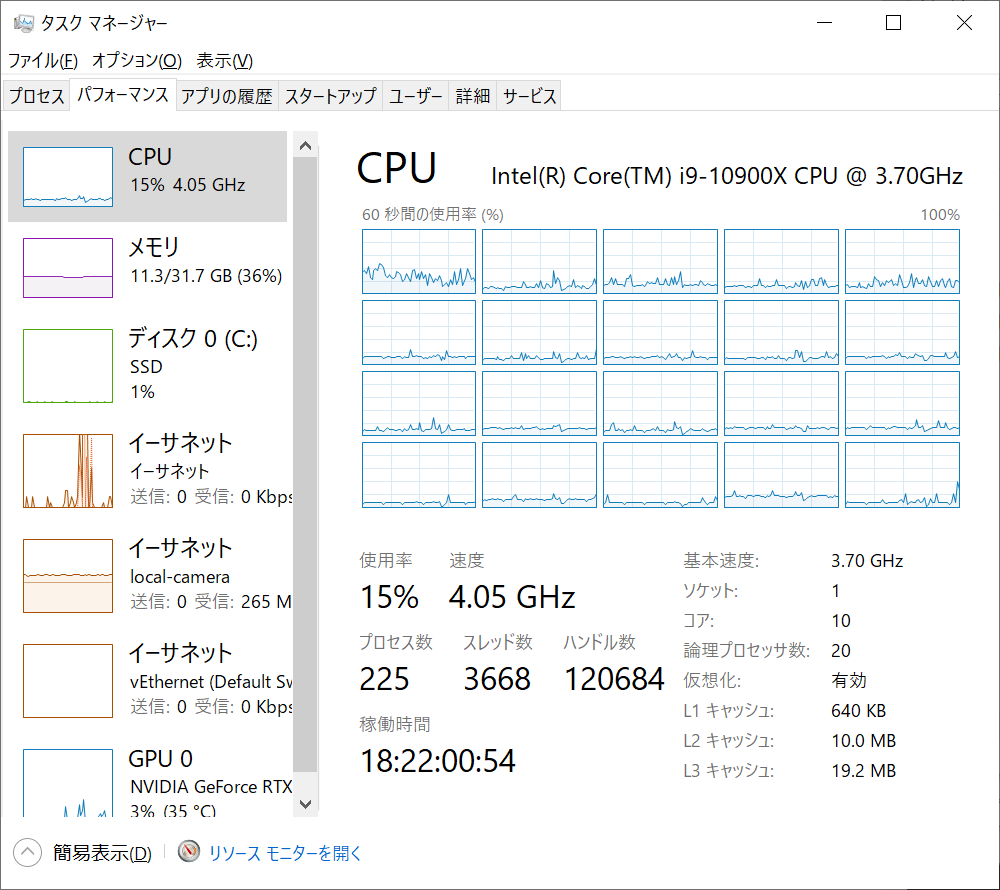
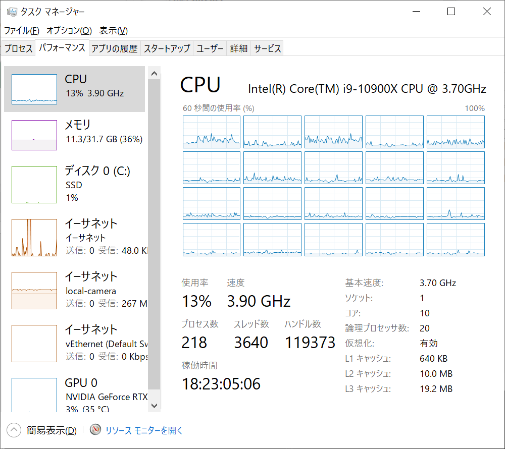

# Performance (Color Model)
**Environment:** Intel(R) Core(TM) i9-10900X CPU @ 3.70GHz　32Gb, Windows10 Pro　21H2 
**Items to Check:**　eBUS Player should draw images continuously and the program should not crash. In the meantime, modified the program to output logs and measured the processing time. 
**Camera:** 16205C-PGE 
**Version:** DV 5.1.0.0 
**Image Size:** 5240x3040 
**FPS:**　Approx. 2.9Hz 
**GAIN:**  1 
**Pixel Format:** BayerRG8
|Image# | thread_num=01 | thread_num=10 | thread_num=20
|--|--|--|--
| 1 | 120.12 | 118.04 | 111.25 
| 2 | 106.42 | 114.70 | 111.66 
| 3 | 103.81 | 117.07 | 111.63 
| 4 | 118.15 | 114.59 | 116.39 
| 5 | 117.18 | 113.88 | 113.80 
| 6 | 119.32 | 113.63 | 111.60 
| 7 | 102.58 | 117.83 | 111.75 
| 8 | 114.03 | 116.64 | 121.19 
| 9 | 114.51 | 116.11 | 112.95 
|10 | 100.95 | 111.37 | 114.20 
|11 | 104.45 | 114.18 | 113.49 
|12 | 122.43 | 112.67 | 111.51 
 

 
&emsp; thread_num=01
&emsp;&emsp;&emsp;&emsp;&emsp;&emsp;&emsp; thread_num=10
&emsp;&emsp;&emsp;&emsp;&emsp;&emsp;&emsp; thread_num=20
 
&emsp;
&emsp;
&emsp;
